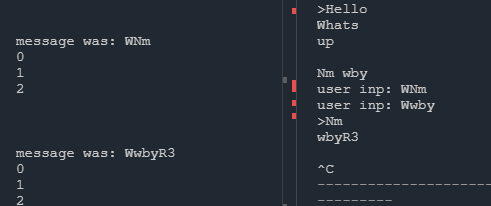

# Chat Server Project

A simple chat server built in C++ that uses socket programming to handle multiple clients. It features a write/read API for clients to send and receive messages, with mutex-based locking to ensure smooth concurrent interactions. This README highlights the core functionalities, ongoing improvements, and future goals for enhancing the server's capabilities and robustness.

## Features

- **Write (POST) Function**: Allows clients to send messages to the server. Each message is added to the chat log.
  - Mutex locks are implemented to ensure that only one client can write to the log at a time.
  - Future goal: Support for larger message payloads to accommodate extensive chat logs.

- **Read (GET) Function**: Enables clients to read the entire chat log, with the option to retrieve specific message indices.
  - Read requests do not wait for the mutex, improving responsiveness for read-only actions.

- **Concurrency with Mutex Locks**: Ensures synchronized access to shared resources, enabling safe simultaneous interactions for read and write actions.

## Project Structure

- **Server**: C++ server handling socket creation, client connections, and the chat log.
  - Uses TCP sockets for reliable data transmission.
  - Binds to port `8080` and accepts client requests.
  - Multi-threaded client handling allows concurrent reads while respecting write access with mutex locks.

- **Client**: Planned development of a client application to interact with the server's API.
  - Will update in real-time to display the current chat log.
  - Planned improvements include user identifiers for messages and automatic chat log refresh.

## Learning Outcomes

1. **Socket Programming Fundamentals**: Understanding the setup and management of socket connections using C++.
2. **Concurrency with Mutexes**: Gaining experience with `std::mutex` to safely handle concurrent data access.
3. **Non-blocking I/O**: Implementing non-blocking mode for the server socket to handle multiple client connections gracefully.
4. **Error Handling**: Improved insights into handling socket errors and creating fallback mechanisms for non-blocking sockets.

## Improvements and Future Plans

1. **Enhanced Payload Support**: Plan to extend `write` requests to handle larger payloads.
2. **User Identification**: Each message will have an associated username to indicate its author.
3. **Timestamps**: Adding timestamps to messages for accurate tracking of conversation flow.
4. **Redundant Message Logs**: Implementing message log redundancy to ensure data persistence in case of server failure.
5. **Idle Thread Management**: Adding functionality to monitor and terminate idle threads, which will improve resource management.

## TODOs

### Repository

- [ ] Complete this README with request formats and examples.
- [ ] Implement pipeline tests to automate project testing and ensure stability.

### Server

- [x] Add a `write`/POST function for clients to write to the chat log.
  - [ ] Support larger payloads.
  - [x] Enforce client turn-taking to manage writes.
- [x] Add a `read`/GET function for clients to retrieve chat logs.
  - [ ] Support larger payloads.
- [x] Implement mutexes for concurrent access management.
  - [x] Read requests are mutex-free for faster performance.
  - [x] Write requests are mutex-protected to avoid data race conditions.
- [ ] Enable usernames for message identification.
- [ ] Add timestamps for message tracking.
- [ ] Implement message log redundancy and persistence.
- [ ] **Thread Accumulation**: Currently, threads are only added to the `client_serverThreads` vector without cleanup.
- [ ] **Idle Timeout**: Threads should have an idle timeout mechanism to avoid resource wastage.

### Client

- [x] Develop a basic client application.
- [x] Auto-update chat log to reflect current messages.
- [x] Parse all entered data as `write` requests.
- [ ] Enable username attachment for chat messages.

## Contributing

Contributions are welcome! Please feel free to submit a pull request or open an issue for any enhancements or bug fixes.

## Code Overview

The server code includes a `write` mutex to synchronize client access to the chat log. Each client connection is handled in a separate thread, and the server supports both read and write operations.

### Notable Bugs/Issues

- [x] When clients send requests in quick succession, the socket buffer will store multiple requests and string them together to act like the same message
  - possible fix is suffixing messages with Newlines `\n`
- [x] When clients send a message and the readThread requests for new messages they will be treated as the same message 
  - possible fix: server reads from the buffer, parses the messages then services each message.
- [] client re-requests the initial payload from server.
  - Possible error is the initial setting of the offset?

---

Thank you for checking out this project! Looking forward to contributions and ideas to make it better. Happy coding!
